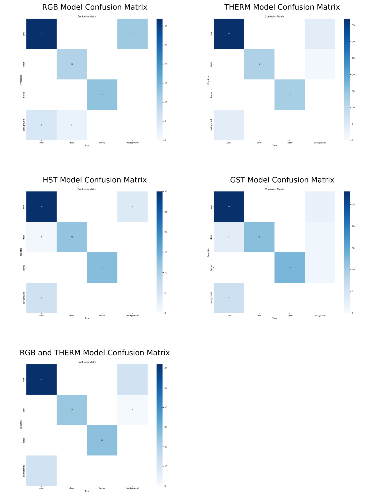
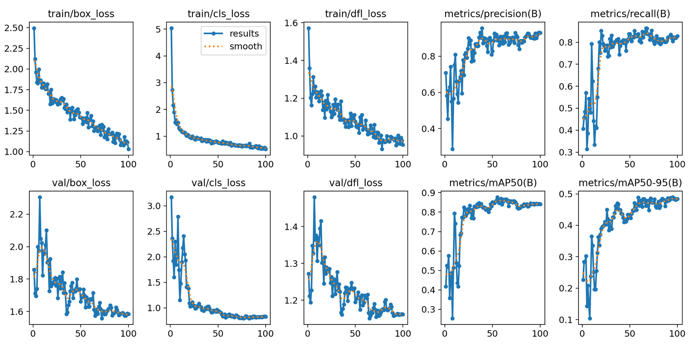
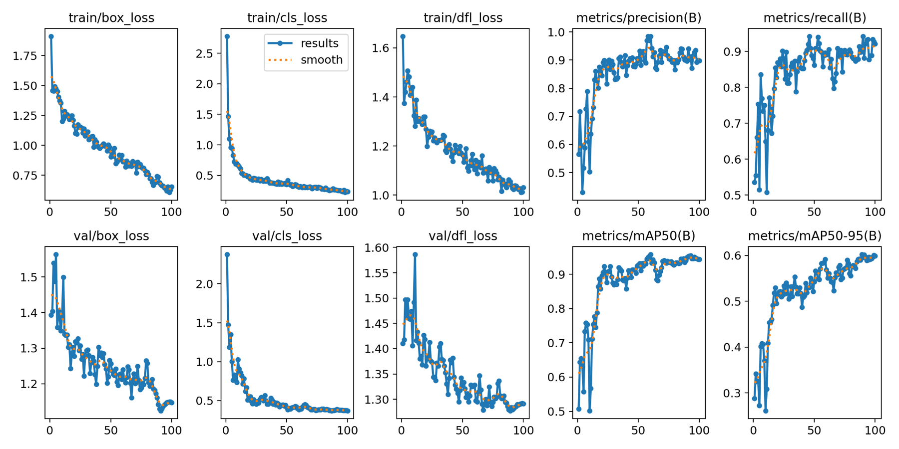
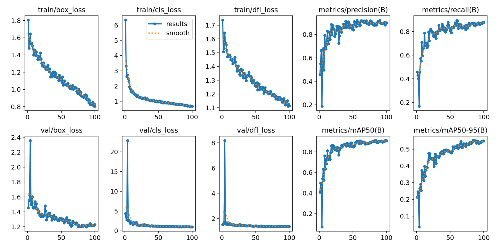
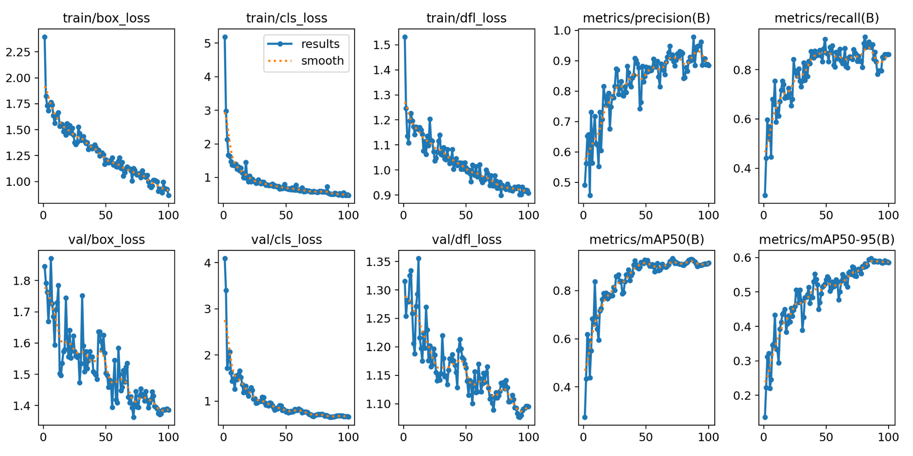
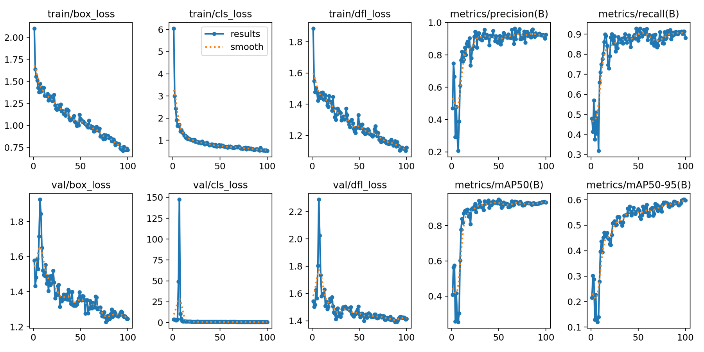
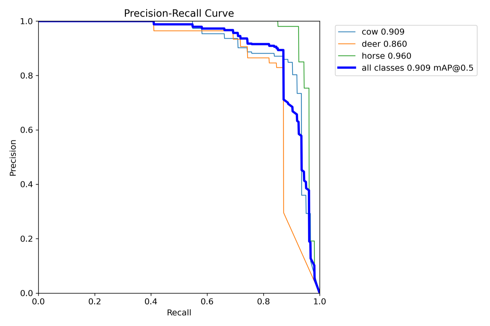
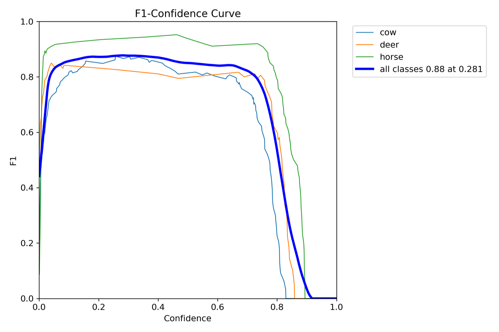

# Panorama Stitching Project for Artificial Vision

---

|  |  |
|---|---|
|  | ## Automatic Panorama Construction with SIFT, ANMS, Matching, DLT, and RANSAC  <br><br> **Course:** Artificial Vision  <br> **Institution:** University of San Andres, Argentina  <br> **Program:** AI Engineering  <br> **Academic Year:** 3rd year |

## Project Overview

This repository contains the final project developed for the **Artificial Vision** course.
The project studies an automatic computer vision pipeline for animal detection under multiple imaging modalities and model strategies, including RGB, thermal, GST, HST, and late-fusion approaches.

## Academic Context

- **Course:** Artificial Vision
- **Final project:** Final course project
- **Institution:** University of San Andres (Argentina)
- **Program:** AI Engineering
- **Program year:** 3rd year

## Abstract

This project explores robust computer vision workflows for detection under multiple sensing modalities. The implementation covers data preparation, training, tuning, and comparative evaluation of YOLOv11-based models across RGB, thermal, GST, HST, and late-fusion configurations.

## Problem Statement

The main objective is to evaluate how different modality setups and fusion strategies impact detection quality and model behavior under a consistent experimental workflow.

## Methodology

1. Prepare and normalize datasets across classes and modalities.
2. Generate reproducible train, validation, and test splits through configuration modules.
3. Tune and train YOLOv11 model variants.
4. Evaluate model outputs and compare metrics.
5. Analyze late-fusion behavior and its effect on final performance.

## Selected Report Figures

The following figures summarize key outputs discussed in the final report.

### Cross-Model Confusion Matrix Overview



### Training and Validation Metrics by Model







### Precision-Recall and F1 Curves (RGB + Thermal)




## Repository Structure

- `src/`: core pipeline, dataloader, YOLO training and evaluation utilities.
- `configs/`: model and dataset parameter configurations.
- `dataset_original/`: original source datasets.
- `dataset_div/`: generated train/validation/test splits.
- `models/`: training outputs and checkpoints.
- `compare_model_metrics/`: cross-model evaluation resources and notebook.
- `main.ipynb`, `main_late_fusion.ipynb`: experiment notebooks.
- `report_Antezana_Giacometti.pdf`: full project report.
- `final_project_poster_artificial_vision_Antezana_Giacometti.pdf`: project poster.

## Installation

```bash
python -m venv .venv
source .venv/bin/activate
pip install -r requirements.txt
```

## Reproducibility

Run experiments from:
- `main.ipynb`
- `main_late_fusion.ipynb`

Check generated outputs in:
- `models/`
- `logs/`
- `compare_model_metrics/`

## Report and Poster

For detailed derivations, quantitative results, and final conclusions, see:
- `report_Antezana_Giacometti.pdf`
- `final_project_poster_artificial_vision_Antezana_Giacometti.pdf`

## Authors

According to the report, this project was developed by:

- **Antezana**
- **Giacometti**

## License

This project is released under the MIT License. See `LICENSE`.
